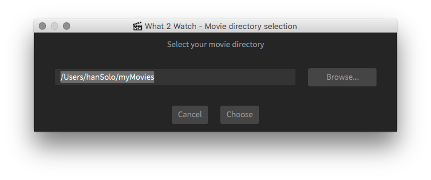
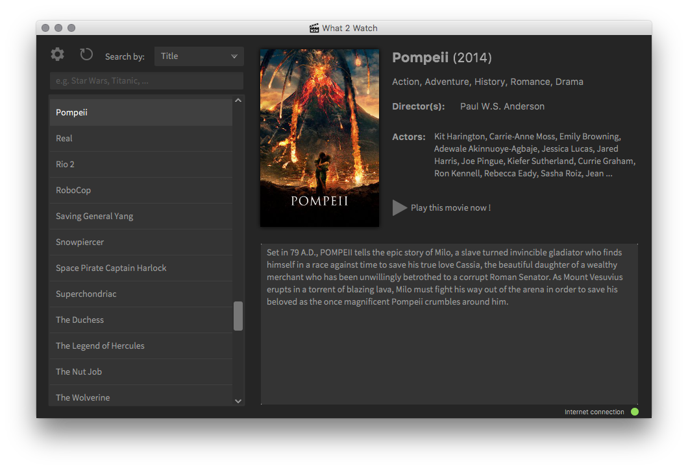
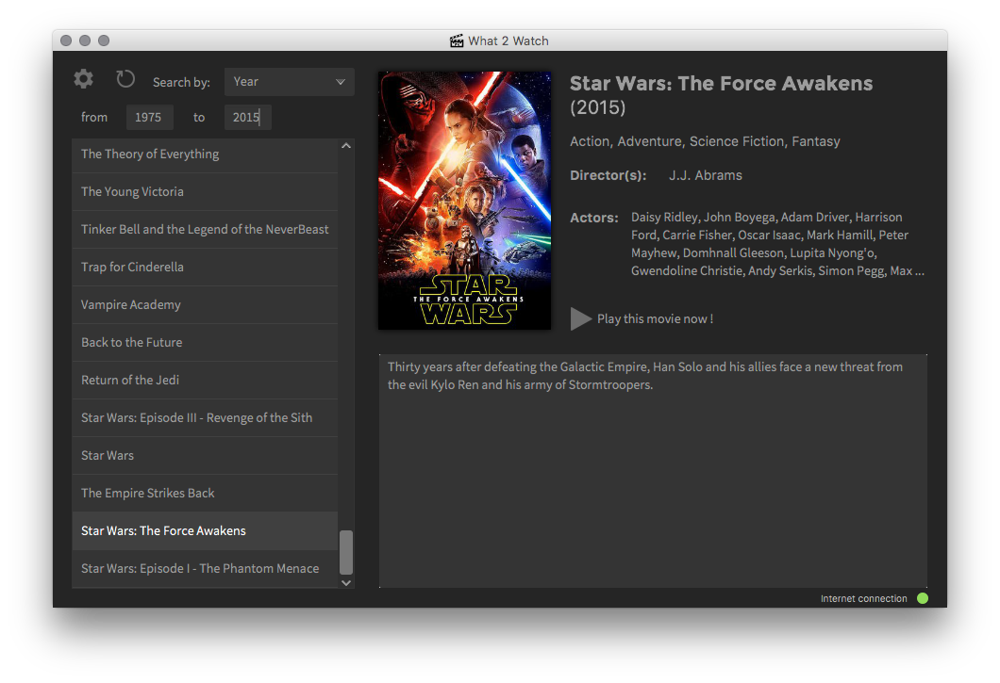

# What2Watch
What 2 Watch is an application written in Java that shows you the informations (title, synopsis, actors, etc.) of movies that are stored in your computer.

## How to use it?

### 1.Select your movie folder
  
All you have to do is chose a folder containing your movies and the app will scan its content in order to build a list.  

---

### 2. Select a movie from the list

Select a movie from the list and What 2 Whatch will show you specific informations.  

---

### 3. Search for a particular movie
You can even search for a movie based on criterias such as actors, directors or even release date.
  

---

## Download
You can download the latest release of What 2 Watch right [here](https://github.com/raph-u/What2Watch/releases)
